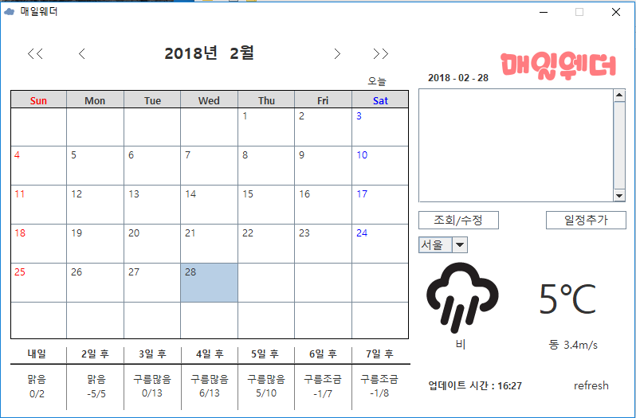
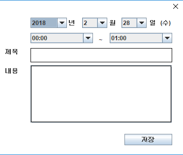

Project name : MaeilWeather 
일정과 주간 날씨 정보를 제공하는 자바 어플리케이션. 
인원 : 5명 
SErver OS :CentOS 6.9 
Database :Oracle 12c EE -SQL Developer 17.4.0 
Development OS:windows 10, ubuntu(Linux) 
platform :java 8 
Tool : Exlipse Oxygen.2 

